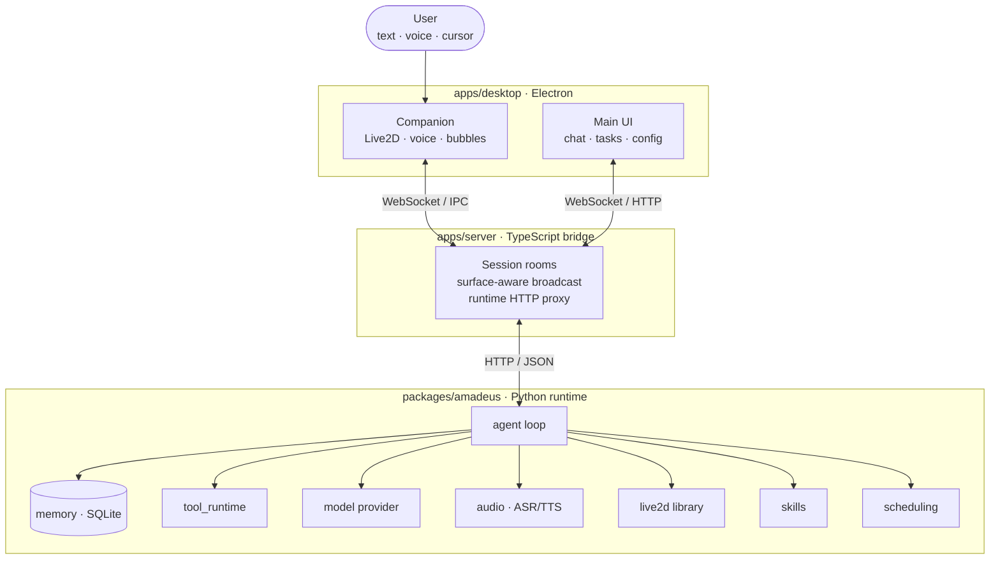
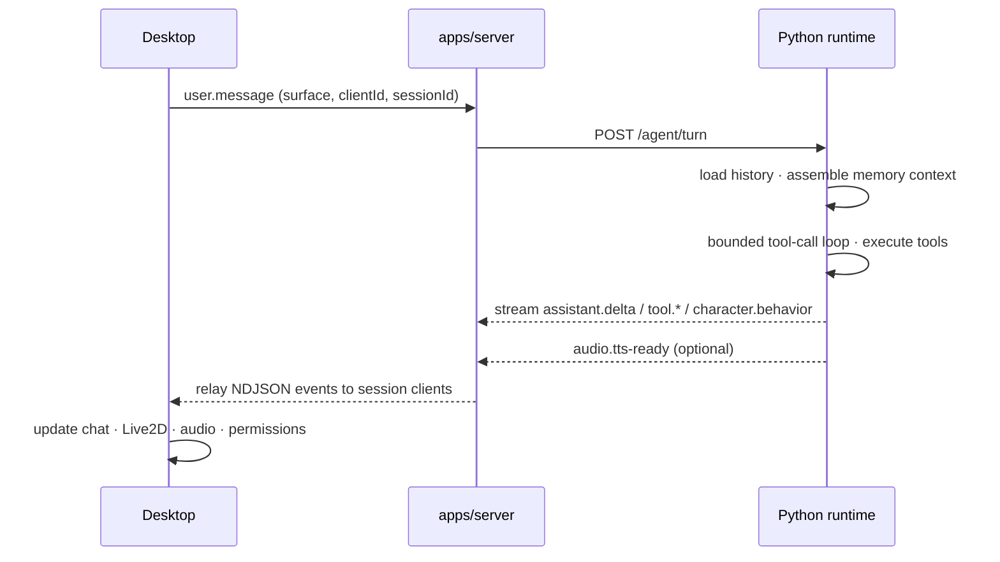

<div align="center">


# Amadeus Agent

**A desktop virtual character agent built around a Live2D presence, real-time interaction, and a local-first runtime.**

[](https://www.python.org/)
[](https://www.typescriptlang.org/)
[](https://vuejs.org/)
[](https://www.electronjs.org/)
[](https://vitejs.dev/)
[](https://www.live2d.com/)
[](docs/project-status.md)

</div>

---

## Overview

Amadeus Agent is not just a chat window. The character reacts through facial expression, motion, speaking state, idle behavior, contextual actions, tools, memory, and audio. It runs a **Python-first agent runtime** with thin TypeScript/Electron adapters wrapped around it, so long-term memory, tool execution, and provider-specific model logic all live in one place while the desktop stays lightweight.

> The project is in a **Python-first migration stage**: the Python runtime owns the preferred turn path, while the TypeScript bridge shrinks toward being a pure transport layer.

## Highlights

| | Feature | Description |
|---|---|---|
| 🎭 | **Live2D companion** | Transparent, frameless, always-on-top desktop presence with gaze tracking, motion, and expression driven by agent state. |
| 🗣️ | **Voice in & out** | Local `faster-whisper` ASR for microphone input and `auto`-selected TTS (GPT-SoVITS or macOS `say`) with hybrid lipsync. |
| 🧠 | **Memory v2** | SQLite-backed history, FTS retrieval, structured facts, human-reviewed memory promotion, and API-call-time context assembly. |
| 🛠️ | **ToolRuntime** | Formal registry with `allow` / `ask` / `deny` permissions, audit trail, timeouts, cancellation, and repeated-call guardrails. |
| 💭 | **Reasoning-aware** | DeepSeek V4 thinking mode handled through a provider-aware reasoning layer that replays `reasoning_content` only where required. |
| ⏰ | **Proactive agent** | Scheduled companion messages, persistent session todos, and in-process task workers with retry and stale-run recovery. |
| 🔌 | **MCP bridge** | Discover and execute remote HTTP JSON-RPC MCP tools with full permission and audit coverage. |

## Architecture

The desktop layer stays thin. It never owns long-term memory, tool execution, provider-specific LLM logic, or agent planning.



### Modules

| Path | Role |
|---|---|
| [`apps/desktop`](apps/desktop) | Electron shell with **Companion** (Live2D, lightweight chat, voice) and **Main UI** window orchestration. |
| [`apps/desktop-ui-next`](apps/desktop-ui-next) | Production Main UI workspace — Vue 3 + Vite + Tailwind v4 for chat, sessions, tasks, timed messages, skills, memory, and config. |
| [`apps/server`](apps/server) | Thin TypeScript bridge: WebSocket fanout plus Live2D / audio / runtime HTTP proxying. |
| [`packages/amadeus`](packages/amadeus) | The agent brain: turn path, provider boundary, Memory v2, ToolRuntime, scheduling, todos, ASR/TTS/Live2D helpers, and the runtime HTTP API. |
| [`packages/live2d-stage`](packages/live2d-stage) | Intended Live2D rendering adapter boundary (not yet the active implementation). |

## Runtime flow



**Voice input path:** Companion records mic audio with `MediaRecorder` → uploads to bridge `POST /audio/transcribe` → forwarded to Python `POST /audio/transcribe` → `asr.default: auto` picks local `faster-whisper` when available → the transcript re-enters the normal `user.message` path.

## Quick start

**Prerequisites:** Node.js + npm, Python 3, and an API key for at least one provider (DeepSeek by default).

```bash
# 1. Install dependencies
npm install
python -m pip install -r requirements.txt

# 2. Configure your provider
cp .env.example .env
#   then set DEEPSEEK_API_KEY (or another provider key) in .env

# 3. Launch the full supervised stack
npm run dev
```

`npm run dev` starts the Python runtime, waits for `/runtime/health`, starts the TypeScript bridge, waits for `/health`, then launches the Electron desktop. If any required child process exits, the supervisor terminates the rest so the stack never silently half-runs.

> The first transcription may download the selected Whisper model. Tune it with `FASTER_WHISPER_MODEL_SIZE`, `FASTER_WHISPER_DEVICE`, `FASTER_WHISPER_COMPUTE_TYPE`, `FASTER_WHISPER_LANGUAGE`, or `FASTER_WHISPER_DOWNLOAD_ROOT`.

### Useful variants

```bash
npm run dev:stack -- --no-desktop      # run runtime + bridge without Electron
npm run dev:stack -- --reuse-existing   # attach to already-running local services
npm run dev:legacy                      # raw concurrent startup (no supervisor)
```

### Development commands

```bash
npm test          # Python unittest + server + desktop tests
npm run test:e2e  # Electron end-to-end smoke and flows
npm run typecheck # typecheck all TS/Vue workspaces + Python
```

## Local runtime

| Service | Address |
|---|---|
| TypeScript bridge | `http://127.0.0.1:8788` · `ws://127.0.0.1:8788/ws` |
| Python runtime | `http://127.0.0.1:8790` |

Default provider environment (stored only in local `.env`, git-ignored):

```env
AMADEUS_LLM_PROVIDER=deepseek
DEEPSEEK_API_KEY=your-key-here
DEEPSEEK_MODEL=deepseek-v4-pro
DEEPSEEK_THINKING_ENABLED=true
DEEPSEEK_REASONING_EFFORT=high
VITE_AGENT_WS_URL=ws://127.0.0.1:8788/ws
```

## Configuration

Runtime behavior is driven by YAML under [`configs/`](configs), loaded at startup and reloadable via `POST /runtime/config/reload`:

| File | Controls |
|---|---|
| [`providers.yaml`](configs/providers.yaml) | OpenAI-compatible model providers and defaults. |
| [`runtime.yaml`](configs/runtime.yaml) | Context/memory budgets, summary compaction, review limits, Companion Live2D fit. |
| [`tools.yaml`](configs/tools.yaml) | Effective tool enabled/permission state and MCP servers. |
| [`harnesses.yaml`](configs/harnesses.yaml) | Active Live2D model and playback-state behavior mapping. |
| [`character.yaml`](configs/character.yaml) | Character persona defaults. |

## Developer diagnostics

The Python runtime exposes structured, local observability surfaces:

- `GET /runtime/health` — health for runtime, model config, memory DB, tools, Live2D, audio, and effective config.
- `GET /memory/context/diagnostics?sessionId=default&limit=10` — recent per-session Memory v2 context assembly decisions.
- `GET /scheduled-jobs?sessionId=companion:default&activeOnly=false` — scheduled companion messages including terminal states.
- `GET /todos?sessionId=companion:default&activeOnly=true` — persistent session todo items.
- `POST /audio/transcribe?format=webm` — transcribe microphone input through the configured ASR provider.
- `GET /runtime/config` — model provider settings including `thinkingEnabled` and `reasoningEffort`.

## Documentation

| Doc | Purpose |
|---|---|
| [project-status.md](docs/project-status.md) | Live source of truth for what's implemented now. |
| [architecture.md](docs/architecture.md) | Current and target architecture. |
| [roadmap.md](docs/roadmap.md) | Forward-looking plan. |
| [event-protocol.md](docs/event-protocol.md) | Runtime event contract between desktop, bridge, and Python. |
| [implementation-notes.md](docs/implementation-notes.md) | Notes on key implementation decisions. |
| [agent-maturity-upgrade-plan.md](docs/agent-maturity-upgrade-plan.md) | Long-term maturity plan. |

## Design references

- `../airi` — primary reference for desktop Live2D, Electron, character UI, audio, and runtime packaging.
- `../hermes-agent` — reference for tool systems, memory, skills, scheduled tasks, and long-running agent behavior.
- `../deepagents` — reference for long-horizon task planning, sub-agents, filesystem tools, and context management.

---

<div align="center">
<sub>Built with a Live2D body, a Python brain, and a local-first heart.</sub>
</div>
